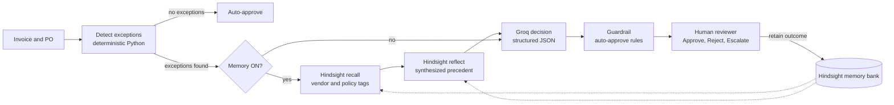

# AP Exception Agent

An accounts payable agent that remembers how your team resolved every past invoice exception, and uses that history to resolve new ones the way your most experienced reviewer would.

Built on [Hindsight](https://github.com/vectorize-io/hindsight), an agent memory system by Vectorize.

## The problem

Accounts payable teams match every invoice against its purchase order. When they don't match, a person has to decide what to do. Most of these exceptions are not new: the same vendor bills freight on a separate line every month, another quotes its own sales order number instead of your PO, a third prints the wrong payment terms. The knowledge of how to handle each case lives in the heads of senior reviewers and in scattered notes.

A stateless AI assistant can't help much here. It sees a $450 freight line and has no idea whether that vendor always does this, whether it was approved last month, or whether a new contract made it invalid three weeks ago.

## What the agent does

For each invoice, the agent:

1. **Detects** exceptions by comparing the invoice to its PO with plain Python: lines not on the PO, price and quantity variances, tax differences, payment terms mismatches, missing PO references, duplicate invoice numbers.
2. **Remembers** by asking Hindsight what past precedent says for this vendor and exception, including any policy or contract change that overrides older patterns.
3. **Decides** with an LLM (Groq) that turns the exceptions and evidence into a structured decision with cited precedents.
4. **Applies a guardrail**: it may only auto-approve with memory evidence, high confidence, and at least two cited precedents. Reject and escalate are always recommendations a human confirms.
5. **Learns** when a reviewer clicks Approve, Reject or Escalate: the outcome is retained into Hindsight, so the next similar invoice benefits.

## Architecture



The LLM never decides when to call memory. The pipeline calls Hindsight deterministically, and the model only produces the final decision as JSON, which is validated and retried once on failure. This avoids the tool-calling errors that open models often make.

## How Hindsight memory is used

**One bank, partitioned by tags.** A Hindsight bank is a recall boundary, and there is no cross-bank query. We use one bank for the whole AP team and tag every memory with `vendor:<id>`, `exception:<type>` and `decision:<outcome>`. Recall filters by the vendor tag plus the `policy` tag, so the agent sees this vendor's history and company-wide AP policies together.

**What gets retained.** Every resolved invoice becomes one natural-language memory, timestamped with its resolution date:

> Invoice MER-2205 from Meridian Logistics, dated 2026-07-13, total $3,885.94, PO reference PO-7705. Exception: freight line of $469.00 not on PO-7705. Reviewer Priya Nair approved it on 2026-07-15. Note: Approved. Recurring Meridian freight charge, amount in normal range.

Policies and contract changes are retained as separate timestamped events.

**Recall and reflect play different roles.** `recall` returns the raw facts and consolidated observations, which we display so the reviewer can see exactly what the agent looked at. `reflect` reasons over the memories and returns a synthesized answer to "what does past precedent say, and has anything changed?" That synthesis is what the decision model relies on.

**The bank has a mission.** It is configured to prioritize past resolutions, reviewer rationale and contract changes, and to treat a newer contract change or policy as overriding older approval patterns. These settings shape how `reflect` reasons.

**Temporal reasoning is the hardest case.** Meridian Logistics billed freight separately for five months and every invoice was approved. On 2026-08-01 a new contract put freight into the unit price. When a new Meridian invoice arrives with a separate freight line, the agent has to notice that the newer contract overrides five consistent approvals. Hindsight's reflect handles this: it cites the contract change and the two compliant invoices since then, and recommends against approval.

## Results

We evaluate on eight unresolved demo invoices, each processed twice with the same model and prompt: once with memory and once without.

| | Memory OFF | Memory ON |
|---|---|---|
| Correct outcome | 5 of 8 | 7 of 8 |
| Resolved without a human | 2 of 8 | 5 of 8 |
| Typical time per exception invoice | about 1 s | about 10 s |

Without memory, the agent is safe but saves no work: it escalates everything it cannot verify, with generic reasoning such as "no prior history for this vendor." With memory, it resolved all three routine exceptions on its own with accurate citations, and still escalated the new vendor that had no precedent.

Two caveats worth stating plainly. The guardrail blocks auto-approval without memory evidence by design, so part of the gap in the second row is structural. And LLM outputs vary slightly between runs, so individual decisions can differ from run to run. Run `python agent.py` to reproduce the evaluation; details are written to `results.json`.

## The data

All data is synthetic, generated with a fixed random seed so every run produces identical files. Eight vendors each have a distinct pattern the agent should learn:

| Vendor | Pattern |
|---|---|
| Meridian Logistics | Bills freight separately, approved until a contract change on 2026-08-01 |
| Northwind Office Supply | Tax differences of a few cents, approved under a $0.05 rounding policy |
| Kestrel Industrial Parts | Quotes its own sales order number instead of the PO number |
| Blue Harbor Packaging | Occasionally resubmits an invoice it already sent |
| Solace Facilities Services | 8% price increase after a contract amendment in June |
| Ardent IT Solutions | Consistently clean |
| Vireo Catering | Prints default payment terms instead of the agreed early payment discount |
| Pinecrest Staffing | New vendor with no history |

The history covers 63 invoices from March to mid-September 2026, plus 8 unresolved invoices for the demo.

## Setup

Requires Python 3.10 or later, a [Hindsight Cloud](https://ui.hindsight.vectorize.io) account (or a self-hosted instance), and a [Groq](https://console.groq.com) API key.

```bash
git clone <this repo>
cd ap-exception-agent
python -m venv venv
# Windows: venv\Scripts\Activate.ps1    Mac/Linux: source venv/bin/activate
pip install -r requirements.txt
```

Copy `.env.example` to `.env` and fill in your keys.

```bash
python generate_data.py          # create the synthetic data
python seed_memory.py --dry-run  # preview every memory in plain English, no API calls
python seed_memory.py            # retain the history into Hindsight (run once)
python agent.py                  # evaluate memory OFF vs ON on the demo invoices
streamlit run app.py             # open the UI
```

## Project structure

| File | Purpose |
|---|---|
| `agent.py` | The agent pipeline: detect, remember, decide, guardrail, learn, plus the evaluation |
| `app.py` | Streamlit UI with the invoice queue, side-by-side comparison and learning buttons |
| `generate_data.py` | Synthetic vendors, POs, invoices, resolutions and events |
| `seed_memory.py` | One-time seeding of Hindsight, with dry-run and resume |
| `smoke_test.py` | Minimal check that retain, recall with tags, and reflect work |
| `groq_test.py` | Minimal check that Groq returns valid structured decisions |

## Limitations and next steps

The evaluation set is small and synthetic. A production version would ingest invoices from an ERP system, use real PO matching rules, and need a larger labeled set to measure accuracy properly. Exception detection is rule-based by design, since matching amounts is not a job for an LLM. Next steps include per-vendor confidence thresholds learned from reviewer overrides, and surfacing Hindsight's consolidated observations as a vendor profile page for the AP team.

## Learn more

- [Hindsight on GitHub](https://github.com/vectorize-io/hindsight)
- [Hindsight documentation](https://hindsight.vectorize.io/)
- [What is agent memory?](https://vectorize.io/what-is-agent-memory)
